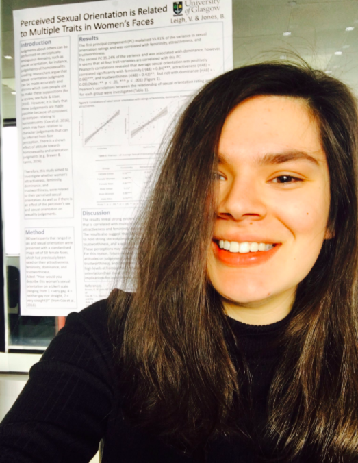

I am a postgraduate student in the University of Glasgow's
[Institute of Neuroscience and Psychology](http://www.gla.ac.uk/researchinstitutes/neurosciencepsychology/) working with [Lisa Debruine](http://facelab.org/People/debruine)

My current work focuses on the influence of parental and sibling phenotype on partner choice and is part of the  [KINSHIP](https://erc.europa.eu/) project. You can find out about previous projects I have worked on in my 'Research' tab. 

I tweet at [@VickyLeigh_](https://twitter.com/VickyLeigh_)

